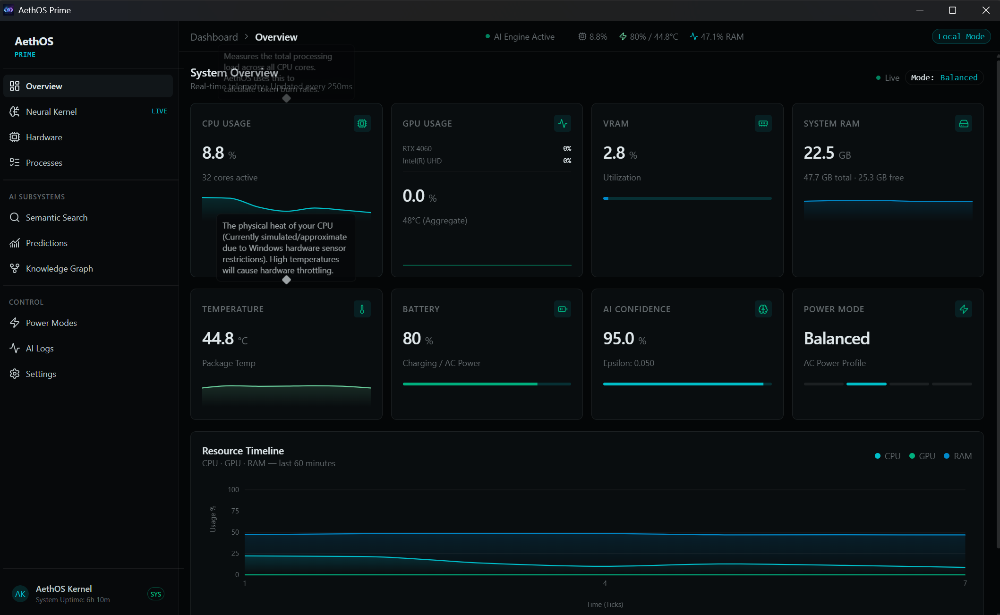
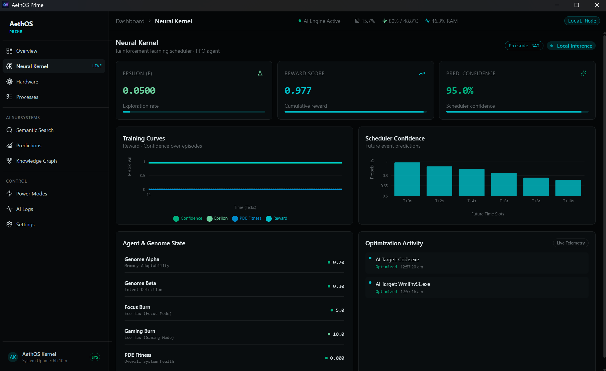
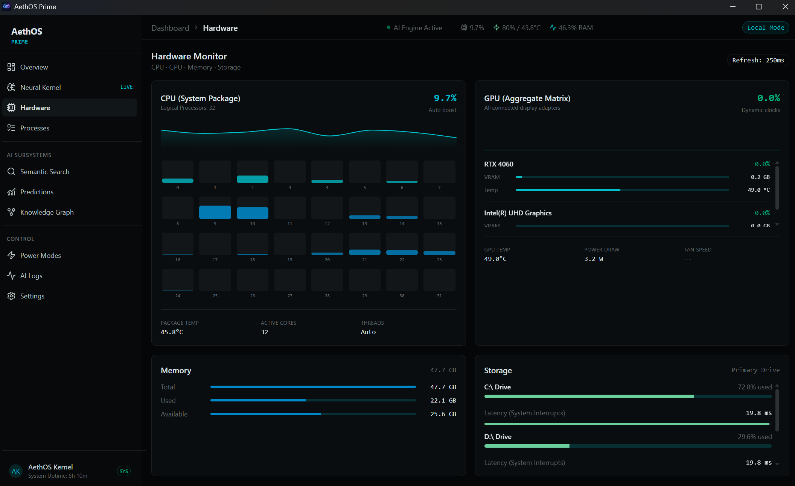
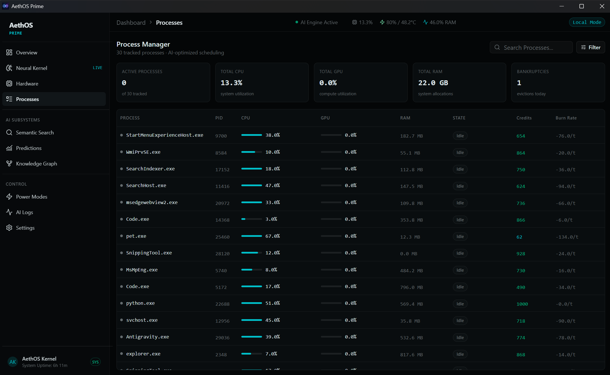
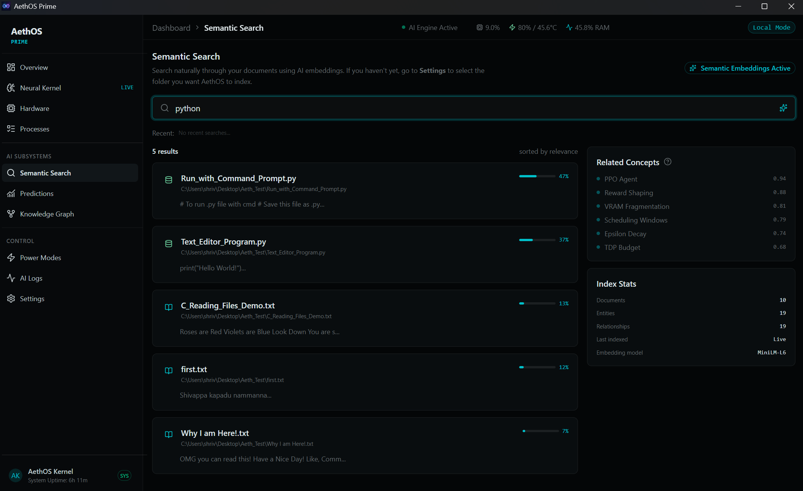
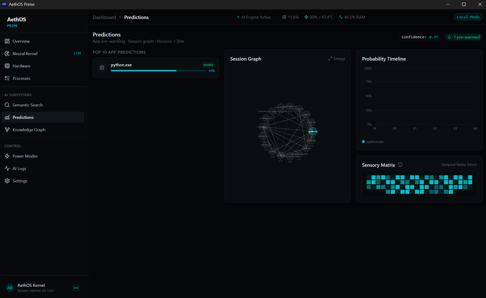
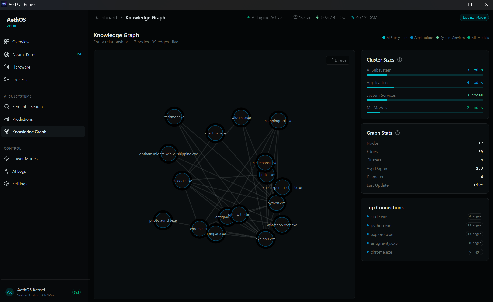
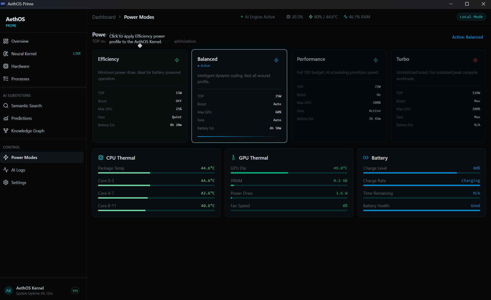
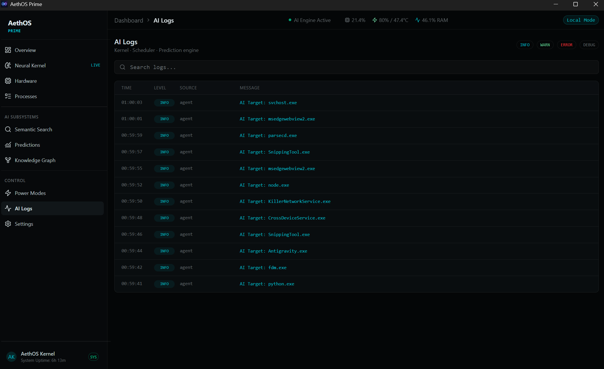
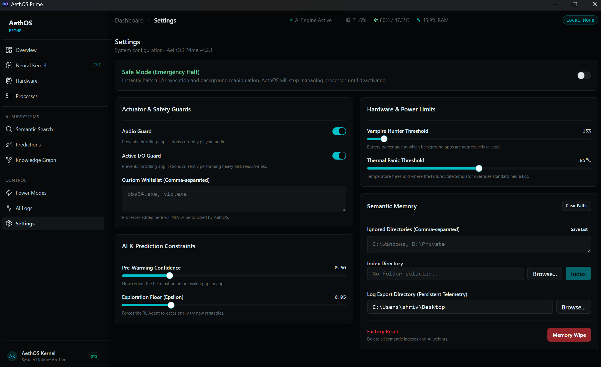

<div align="center">
  
  <h1>AethOS Prime</h1>
  <p><em>A User-Space AI Operating System Optimization Kernel Tool</em></p>
  <p>
    
    
    
    
    
  </p>
</div>

---

## Table of Contents
1. [Project Philosophy](#project-philosophy)
2. [System Architecture](#system-architecture)
3. [Installation and Setup](#installation-and-setup)
4. [Dashboard: Tab-by-Tab Guide](#dashboard-tab-by-tab-guide)
   - [Overview](#1-overview)
   - [Neural Kernel](#2-neural-kernel)
   - [Hardware](#3-hardware)
   - [Processes](#4-processes)
   - [Semantic Search](#5-semantic-search)
   - [Predictions](#6-predictions)
   - [Knowledge Graph](#7-knowledge-graph)
   - [Power Modes](#8-power-modes)
   - [AI Logs](#9-ai-logs)
   - [Settings](#10-settings)
5. [Backend Deep Dive](#backend-deep-dive)
   - [The Kernel Loop](#the-kernel-loop)
   - [Deep Q-Learning Agent](#deep-q-learning-agent)
   - [Semantic Vector Database (FAISS)](#semantic-vector-database-faiss)
   - [Markov-Chain Predictor](#markov-chain-predictor)
   - [Session Logger](#session-logger)
6. [Data Sovereignty and Privacy](#data-sovereignty-and-privacy)
7. [Configuration Reference](#configuration-reference)
8. [Running Tests](#running-tests)
9. [Project Structure](#project-structure)
10. [Contributing](#contributing)

---

## Project Philosophy

Modern operating systems treat all users identically. Whether you are compiling code, rendering 3D assets, or simply browsing the web, the Windows process scheduler applies the same generic heuristics to allocate CPU time, memory, and thermal headroom. This approach is fundamentally inefficient because it is entirely agnostic to context. A background Windows Update downloading at full bandwidth while you are in a competitive game is not a scheduling conflict the OS was designed to resolve.

AethOS Prime is a deterministic, AI-driven Hardware Abstraction Layer (HAL) that sits in user-space between the Windows kernel and your active applications. It continuously observes hardware telemetry, learns your specific behavioral patterns through Reinforcement Learning, and physically manipulates process priorities and power profiles via the Win32 API to ensure your foreground application always receives maximum resources.

AethOS does not require kernel drivers, administrator privileges for basic operation, or any cloud connectivity. It is a portable, self-contained intelligence layer that learns locally and acts locally.

---

## System Architecture

AethOS operates on a bifurcated client-server architecture running entirely on localhost:

```
                     ┌──────────────────────────────────┐
                     │     React / Vite Dashboard       │
                     │     (PyWebView Chromium Shell)   │
                     └──────────────┬───────────────────┘
                                    │ Socket.IO (ws://localhost:5000)
                                    │ Bidirectional @ 250ms
                     ┌──────────────┴───────────────────┐
                     │     Flask + Socket.IO Server     │
                     │     (AethosBridge)               │
                     └──────────────┬───────────────────┘
                                    │
               ┌────────────────────┼────────────────────┐
               │                    │                    │
    ┌──────────┴──────────┐  ┌──────┴──────┐  ┌──────────┴──────────┐
    │   Neural Kernel     │  │  FAISS DB   │  │   Session Logger    │
    │   (PyTorch DQN)     │  │  (Semantic  │  │   (ai_logs/         │
    │   Epsilon-Greedy    │  │   Memory)   │  │    terminal_logs/   │
    │   Experience Replay │  │             │  │    system_events/)  │
    └─────────────────────┘  └─────────────┘  └─────────────────────┘
```

**Frontend**: A Vite-bundled React 19 application using shadcn/ui components, Recharts for data visualization, and Lucide icons. The production build is served directly from the `frontend/dist` folder by the Flask backend. This architecture natively couples the backend to the frontend repo structure, eliminating the need to copy assets around and vastly improving the developer experience for open-source contributors. The UI is rendered inside a native PyWebView window so no external browser is needed.

**Backend**: A multi-threaded Python daemon built on Flask and Flask-SocketIO. The primary event loop (the "Kernel") ticks at 4Hz (250ms intervals), aggregating telemetry from `psutil`, passing it through a PyTorch Deep Q-Network, and emitting the resulting system state to the frontend via WebSocket.

---

## Installation and Setup

### Prerequisites

| Requirement | Version | Purpose |
|---|---|---|
| Python | 3.10 or later | Backend runtime, PyTorch, FAISS |
| Node.js | 18 or later | Building the React frontend |
| Windows | 10 / 11 | Required for Win32 API calls (EcoQoS, power profiles) |

### One-Command Setup

A single setup script is provided that automates the entire installation process. Open a terminal in the root of this repository and run:

```cmd
setup.bat
```

This script will:
1. Verify that Python and Node.js are installed on your system.
2. Create an isolated Python virtual environment (`backend/venv/`).
3. Install all Python dependencies from `backend/requirements.txt` (PyTorch, psutil, Flask, sentence-transformers, FAISS).
4. Install all Node.js dependencies for the React frontend.
5. Compile the React dashboard into optimized static assets.
6. Launch AethOS Prime.

After the first run, you can start AethOS directly with:

```cmd
cd backend
venv\Scripts\activate
python main.py
```

### Manual Setup

If you prefer to install dependencies manually or encounter issues with the automated script, follow these steps. **Run all commands starting from the root directory.**

1. **Setup Python Backend**:
   ```cmd
   cd backend
   python -m venv venv
   venv\Scripts\activate
   pip install -r requirements.txt
   cd ..
   ```

2. **Build React Frontend**:
   ```cmd
   cd frontend
   npm install
   npm run build
   cd ..
   ```

3. **Launch**:
   ```cmd
   cd backend
   venv\Scripts\activate
   python main.py
   ```

### Troubleshooting: Virtual Machine Installs

**1. NPM Installation Fails (Assertion failed: new_time >= loop->time)**
This is a known Windows bug in Node.js's underlying `libuv` engine. When a VM hypervisor forcefully syncs the virtual clock *backwards* by a few milliseconds to match the host machine, Node.js panics. 
**The Fix**: Do not run `npm install` in the VM. Instead, run `npm install` and `npm run build` on your physical Host PC. Then, compress the resulting `frontend/dist` folder into a ZIP file, drag it into the VM, and extract it to `AethOS_Repository/frontend/dist`. 

**2. Black Screen on Launch**
If you pushed your code to GitHub and pulled it inside a VM, you will get a black screen. This is because the `.gitignore` file specifically ignores the compiled `frontend/dist/` folder (standard developer practice).
**The Fix**: You must manually transfer the compiled `dist` folder from your Host PC to your VM using the ZIP method mentioned above.

**3. Default PyWebView Logo showing instead of AethOS Logo**
Modern web browsers (and WebView2) can natively render `.png` favicons for the window. However, the low-level Windows API (`LoadImageW`) used by PyWebView strictly requires a `.ico` file to set the Taskbar icon. If you only provide `logo.png` in the `frontend/public/` folder, the Windows API silently fails and falls back to the default PyWebView icon.
**The Fix**: Convert your `logo.png` to a `logo.ico` file, place it in `frontend/public/`, and run `npm run build` again. Both files must be shipped for maximum compatibility.

### First Launch Behavior

When AethOS boots for the very first time, it will automatically connect to Hugging Face and download the offline AI Brain (`all-MiniLM-L6-v2`). You will see it downloading about 50 tensor files in the console. **This is a one-time operation.**

You will also notice:
- **Epsilon is 1.0** (100% exploration). The AI has no learned behavior and will randomly explore different throttling strategies.
- **Prediction Confidence is 0%**. The Markov chain has no app-switching history to predict from.
- **Semantic Memory is empty**. No files have been indexed into the FAISS vector database.
- **Knowledge Graph is empty**. No relationships have been mapped.

Over time, as you use your computer normally, AethOS will:
- Decay epsilon toward its configured floor (default 0.05), shifting from exploration to exploitation.
- Build a statistical model of your app-switching habits.
- Persist all learned neural weights to `backend/storage/brain.pth` so it remembers across reboots.

---

## Dashboard: Tab-by-Tab Guide

The sidebar organizes the dashboard into three groups: **Core** (system monitoring), **Intelligence** (AI features), and **System** (configuration).

---

### 1. Overview



The mission control panel. Streams live hardware telemetry at 4Hz with the following metric cards:

| Metric | Source | Description |
|---|---|---|
| **CPU Usage** | `psutil.cpu_percent()` | Aggregate load across all logical processors. Displays core count and a sparkline mini-chart of the last 60 readings. Turns amber when usage exceeds 85%. |
| **GPU Usage** | `GPUtil` / WMI | Aggregate GPU utilization. If multiple GPUs are detected (e.g., integrated Intel + discrete NVIDIA), each card is listed individually with its own utilization percentage. |
| **VRAM** | `GPUtil` | Video RAM utilization as a percentage. A progress bar visually indicates saturation. |
| **System RAM** | `psutil.virtual_memory()` | Displays used RAM in GB, total RAM, and available RAM. A sparkline tracks memory pressure over time. |
| **Temperature** | `psutil.sensors_temperatures()` | CPU package temperature in Celsius. Turns amber above 85°C. |
| **Battery** | `psutil.sensors_battery()` | Current battery percentage and charging state. AethOS adjusts its optimization genome when on battery power. |
| **AI Confidence** | `1.0 - epsilon` | How heavily the Neural Kernel relies on learned knowledge versus random exploration. Displayed as a percentage with a progress bar. |
| **Power Mode** | Active power profile | Shows the current mode (Efficiency, Balanced, Performance, Turbo) with a segmented indicator. |

**Resource Timeline**: A large area chart at the bottom tracks CPU, GPU, and RAM utilization over the last 60 ticks. Each resource is rendered as a gradient-filled curve with its own legend.

**Quick Stats Row**: Six compact tiles at the bottom display Storage usage, Tasks Optimized, Average Latency (ms), Prediction Probability, Suffering Index, and total System Ticks since boot. Each tile has a hover tooltip explaining the metric.

---

### 2. Neural Kernel



The Reinforcement Learning control center. Displays the internal state of the Deep Q-Learning agent.

**Header Badges**:
- **Episode Counter**: The current continuous learning cycle. Increases as AethOS completes observation phases.
- **Local Inference**: Indicates the AI is actively monitoring but in a stable inference state.

**Primary Metrics** (three cards):
- **Epsilon**: The current exploration rate. At 0.05, the AI takes random actions only 5% of the time. Displayed with a flask icon and progress bar.
- **Reward Score**: Calculated as `1.0 - suffering`. Ranges from 0.0 (system is suffering) to 1.0 (perfectly optimized).
- **Prediction Confidence**: Inverse of epsilon, displayed as a percentage (e.g., 95.0%).

**Training Curves Chart**: A multi-line chart plotting Reward, Confidence, PDE Fitness, and Epsilon over the last 60 episodes. In stable operation, these lines remain mostly flat.

**Scheduler Confidence Chart**: A bar chart showing the AI's confidence in predicting future time slots (T+0s through T+10s).

**Agent and Genome State**: A detailed list of the AI's internal parameters:
- **Genome Alpha** (Memory Adaptability): How heavily the AI relies on historical habits versus recent events.
- **Genome Beta** (Intent Detection): How quickly the AI reacts to unexpected heavy applications.
- **Focus Burn**: The "eco tax" applied to background apps during normal usage.
- **Gaming Burn**: The maximum punishment applied to background apps during GPU-intensive workloads.
- **PDE Fitness**: A composite health score combining latency, battery drain, and thermal throttling.

**Optimization Activity Log**: A live feed of the last 5 AI decisions, showing whether each action was "Optimized" or "Blocked", along with timestamps.

---

### 3. Hardware



A deep hardware diagnostic panel with four sections:

**CPU Section**:
- Package utilization percentage with a sparkline.
- A visual **core grid** showing each logical processor as a vertical bar. Performance cores (P-Cores) are color-coded differently from Efficiency cores (E-Cores). Hovering over any core shows its individual utilization and the top processes consuming it.
- Stats: Package Temperature, Active Core Count, Thread Mode.

**GPU Section**:
- Per-GPU card listing with individual utilization, VRAM usage (used/total in GB), and temperature.
- A sparkline tracking GPU utilization over time.

**Memory Section**:
- Physical RAM: Used, Available, and Total in GB with a progress bar.
- Swap: Used and Total with a progress bar.

**Storage Section**:
- Per-drive listing (e.g., C:, D:) showing used percentage, used space, and total capacity.

---

### 4. Processes



A real-time process manager that replaces the Windows Task Manager for monitoring purposes.

**Columns**: PID, Process Name, CPU%, Memory (MB), Status.

The currently active foreground application is highlighted. Processes that the AI has throttled via EcoQoS are visually marked. The list updates every 250ms in sync with the kernel tick.

---

### 5. Semantic Search



An offline, meaning-aware search engine powered by the FAISS vector database.

**How it works**: After indexing a directory in Settings, you can type natural language queries (e.g., "machine learning optimization strategies") and AethOS will return the most semantically similar text chunks from your indexed files, ranked by cosine similarity score.

This is not keyword matching. The `sentence-transformers/all-MiniLM-L6-v2` model converts your query and all indexed documents into 384-dimensional floating-point embeddings, then performs approximate nearest-neighbor search using FAISS.

---

### 6. Predictions



Displays the Markov-chain app-switching predictions. AethOS tracks which applications you switch between and in what order. Over time, it builds a probability model that predicts which app you are likely to open next.

If the prediction confidence exceeds the configured Pre-Warming threshold (default 0.60), AethOS will begin pre-loading the predicted application's memory pages before you click it.

---

### 7. Knowledge Graph



A visual node-edge diagram showing the relationships between your indexed files. After indexing a directory, AethOS calculates semantic similarity between every pair of document chunks and draws edges between related nodes. This creates a navigable map of how your files relate to each other conceptually.

---

### 8. Power Modes



Controls the active Windows power profile. Available modes:

| Mode | Behavior |
|---|---|
| **Efficiency** | Caps CPU frequency and aggressively throttles background processes. Ideal for battery life. |
| **Balanced** | Standard Windows scheduling with moderate AethOS intervention. |
| **Performance** | Uncaps CPU frequency and elevates foreground process priority. |
| **Turbo** | Maximum performance. Disables all power-saving heuristics and gives the foreground application absolute priority. |

---

### 9. AI Logs



A scrollable log panel showing the AI's decision stream. Each entry shows the timestamp, the action taken (e.g., "Throttled chrome.exe"), and whether it was an exploration or exploitation decision. Logs are also persisted to the `ai_logs/` subdirectory of your configured Log Export Directory.

---

### 10. Settings



The configuration hub, organized into four cards:

**Actuator and Safety Guards**:
- **Safe Mode** (Emergency Halt): A prominent switch that instantly stops all AI execution and background manipulation.
- **Audio Guard**: Toggle. When enabled, AethOS will never throttle an application that is currently playing audio.
- **Active I/O Guard**: Toggle. When enabled, AethOS will never throttle an application performing heavy disk I/O.
- **Custom Whitelist**: A comma-separated text field for process names (e.g., `obs64.exe, vlc.exe`) that AethOS should never touch.

**AI and Prediction Constraints**:
- **Pre-Warming Confidence** (Slider: 0.50 - 0.99): The minimum Markov-chain probability required before AethOS pre-loads a predicted application.
- **Exploration Floor / Epsilon** (Slider: 0.01 - 0.20): The minimum random exploration rate. Even at full training, the AI will take random actions at this rate to avoid getting stuck in local optima.

**Hardware and Power Limits**:
- **Vampire Hunter Threshold** (Slider: 10% - 90%): The battery percentage below which AethOS aggressively evicts background processes.
- **Thermal Panic Threshold** (Slider: 75°C - 95°C): The CPU temperature at which AethOS overrides normal heuristics and forces aggressive thermal throttling.

**Semantic Memory**:
- **Clear Paths** button: Clears the Index Directory and Log Export Directory from the configuration without deleting any AI weights or neural data.
- **Ignored Directories**: A comma-separated text area for directories the indexer should skip (e.g., `C:\Windows, D:\Private`). Has a dedicated **Save List** button.
- **Index Directory**: A file browser to select a directory for semantic indexing. Click **Browse** to select, then **Index** to begin the embedding process.
- **Log Export Directory**: A file browser to select where AethOS should persist session logs. Logs are organized into `ai_logs/`, `terminal_logs/`, and `system_events/` subdirectories.
- **Factory Reset / Memory Wipe**: A destructive button that deletes `brain.pth`, `index.json`, and `graph.json`, then forcefully terminates the kernel. All learned behavior is erased. Configuration settings (sliders, toggles, paths) are preserved.

---

## Backend Deep Dive

### The Kernel Loop

The `Kernel` class in `main.py` runs the primary event loop. On each tick (every 250ms):

1. Polls `psutil` for CPU, RAM, temperature, battery, and disk metrics.
2. Polls `GPUtil` for GPU utilization, VRAM, and temperature per card.
3. Detects the active foreground window via `win32gui.GetForegroundWindow()`.
4. Passes the aggregated state through the DQN agent to produce an action.
5. Applies the action (throttle, boost, or ignore) to background processes via `SetProcessInformation` (EcoQoS API).
6. Emits the complete system state payload to the frontend via Socket.IO.
7. Logs the decision to the session logger.

### Deep Q-Learning Agent

Located in `aethos/intelligence/agent.py`. The agent uses:

- **Network**: A fully-connected neural network with an input dimension of 6 (CPU%, RAM%, Temp, VRAM%, process CPU, process RAM), hidden layers, and an output dimension of 3 (actions: throttle, boost, ignore).
- **Experience Replay**: A `ReplayBuffer` (deque of 10,000 transitions) that stores `(state, action, reward, next_state)` tuples. The agent samples random mini-batches for training to break temporal correlations.
- **Epsilon-Greedy Policy**: Starts at `epsilon_start=1.0` and decays toward the configured floor (default 0.05). At each step, with probability epsilon, a random action is chosen; otherwise, the action with the highest Q-value is selected.
- **Hyperparameters**: Learning rate `1e-3`, discount factor `gamma=0.99`.
- **Persistence**: The model weights are saved to `storage/brain.pth` and loaded on startup.

### Semantic Vector Database (FAISS)

Located in `aethos/storage/semantic.py` and `aethos/storage/indexer.py`.

The `LocalIndexer` recursively walks the user-specified directory, reads text files, splits them into ~500-word chunks, and passes each chunk through `sentence-transformers/all-MiniLM-L6-v2` to produce 384-dimensional embeddings. These embeddings are stored in a FAISS `IndexFlatL2` for fast approximate nearest-neighbor retrieval.

The `KnowledgeGraph` in `aethos/storage/graph.py` calculates pairwise cosine similarity between all chunks and stores edges above a similarity threshold in `storage/graph.json`.

### Markov-Chain Predictor

Located in `aethos/intelligence/predictor.py`. Maintains a transition matrix of app-switching events. When app A is followed by app B, the `(A, B)` transition count is incremented. The predictor outputs the most probable next application and its confidence score.

### Session Logger

Located in `aethos/core/session_logger.py`. Acts as a `logging.Handler` that intercepts Python's standard logging output. When a Log Export Directory is configured, it writes timestamped session files into three subdirectories:
- `ai_logs/`: Neural network decisions, epsilon values, reward scores.
- `terminal_logs/`: Raw stdout/stderr, boot sequences, stack traces.
- `system_events/`: Process state arrays, hardware metrics, thermal events.

---

## Data Sovereignty and Privacy

AethOS is 100% offline. There are no network requests, no cloud APIs, no telemetry uploads, and no Docker containers. Every piece of data generated by the system stays on your local hard drive:

| Data | Location | Contains |
|---|---|---|
| Neural weights | `backend/storage/brain.pth` | Trained PyTorch model parameters |
| Semantic index | `backend/storage/index.json` | FAISS vector embeddings |
| Knowledge graph | `backend/storage/graph.json` | File relationship edges |
| User settings | `backend/storage/config.json` | Slider values, toggles, paths |
| Session logs | User-configured directory | Timestamped AI decisions and hardware metrics |

To completely erase all learned data, use the **Memory Wipe** button in Settings.

---

## Configuration Reference

All settings are persisted in `backend/storage/config.json`. The following keys are available:

| Key | Type | Default | Description |
|---|---|---|---|
| `safe_mode` | bool | `true` | Halts all AI execution when enabled |
| `audio_guard` | bool | `true` | Protects audio-playing apps from throttling |
| `io_guard` | bool | `true` | Protects I/O-heavy apps from throttling |
| `vhp_thresh` | int | `15` | Battery % threshold for aggressive background eviction |
| `thermal_panic` | int | `85` | Temperature (°C) threshold for emergency throttling |
| `prewarm_confidence` | float | `0.60` | Minimum Markov confidence to pre-warm predicted apps |
| `exploration_floor` | float | `0.05` | Minimum epsilon (random exploration rate) |
| `custom_whitelist` | list | `[]` | Process names that are never throttled |
| `ignored_dirs` | list | `[]` | Directories excluded from semantic indexing |
| `index_directory` | string | `""` | Path to the directory being indexed |
| `log_export_path` | string | `""` | Path where session logs are exported |

---

## Running Tests

Unit tests are located in `backend/tests/`. Run the full suite with:

```cmd
cd backend
python -m unittest discover tests/
```

| Test File | Tests |
|---|---|
| `test_config.py` | ConfigManager initialization, default values, persistence |
| `test_agent.py` | DQNAgent initialization, PyTorch tensor creation |
| `test_scheduler.py` | BaseScheduler initialization with mocked process manager |

---

## Project Structure

```
AethOS_Repository/
├── setup.bat                    # One-click installation and launch script
├── README.md                    # This document
├── .gitignore                   # Git exclusion rules
│
├── backend/                     # Python Neural Kernel
│   ├── main.py                  # Entry point and Kernel event loop
│   ├── requirements.txt         # Pip dependency list
│   ├── environment.yml          # Conda environment specification
│   ├── aethos/
│   │   ├── core/
│   │   │   ├── config.py        # ConfigManager (persistent settings)
│   │   │   ├── manager.py       # Process manager and Win32 API hooks
│   │   │   ├── session_logger.py # Telemetry logging to disk
│   │   │   └── scheduler_interface.py # State encoding and scheduling
│   │   ├── intelligence/
│   │   │   ├── agent.py         # DQNAgent, ReplayBuffer, epsilon decay
│   │   │   ├── brain.py         # PyTorch neural network architecture
│   │   │   ├── predictor.py     # Markov-chain app predictions
│   │   │   ├── context.py       # Context awareness engine
│   │   │   ├── simulator.py     # Future state simulation
│   │   │   ├── evolution.py     # Genetic optimization of hyperparameters
│   │   │   ├── fabric.py        # Neural fabric connections
│   │   │   └── vision.py        # System vision and pattern recognition
│   │   ├── interface/
│   │   │   ├── bridge.py        # Flask + Socket.IO + PyWebView bridge
│   │   │   └── assets/          # Compiled React frontend (generated by setup)
│   │   └── storage/
│   │       ├── semantic.py      # FAISS vector database
│   │       ├── indexer.py       # Recursive file indexer
│   │       └── graph.py         # Knowledge graph builder
│   └── tests/
│       ├── test_config.py
│       ├── test_agent.py
│       └── test_scheduler.py
│
└── frontend/                    # React / Vite Dashboard
    ├── src/
    │   ├── App.tsx              # Root component with Socket.IO connection
    │   └── components/
    │       ├── aethos/
    │       │   ├── AppSidebar.tsx     # Navigation sidebar
    │       │   ├── MetricCard.tsx     # Reusable metric display card
    │       │   ├── MiniChart.tsx      # Sparkline chart component
    │       │   └── panels/           # One file per dashboard tab
    │       └── ui/                   # shadcn/ui component library
    ├── index.html
    ├── vite.config.ts
    └── package.json
```

---

## Contributing

Contributions are welcome. If you are interested in:
- Adding Linux support (replacing Win32 API calls with `cgroups`)
- Implementing GPU-accelerated FAISS indexing
- Building a more sophisticated reward function
- Adding support for AMD GPU telemetry
- Or any other New Feature

Please open an issue or submit a pull request.

---

## License

This project is licensed under the MIT License - see the [LICENSE](LICENSE) file for details.

---

<div align="center">
  <sub>Built with PyTorch, React, Flask, FAISS, and the Win32 API.</sub>
</div>
